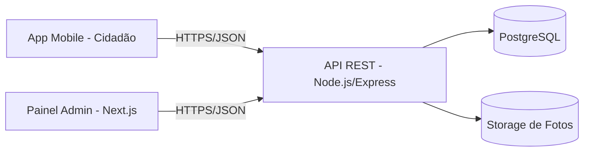

# Arquitetura do projeto

## Visão geral

O MVP é dividido em três aplicações independentes que compartilham a mesma API/backend:



## Estrutura de pastas

```
.
├── backend/
│   ├── prisma/
│   │   └── schema.prisma          # Modelagem do banco (Usuario, Chamado, Secretaria, ...)
│   ├── src/
│   │   ├── config/
│   │   │   └── env.ts             # Leitura/validação de variáveis de ambiente
│   │   ├── controllers/
│   │   │   ├── chamados.controller.ts
│   │   │   └── auth.controller.ts
│   │   ├── routes/
│   │   │   ├── chamados.routes.ts
│   │   │   ├── auth.routes.ts
│   │   │   └── index.ts           # Agrega todas as rotas em /api
│   │   ├── middlewares/
│   │   │   ├── auth.middleware.ts # Valida JWT e injeta req.user
│   │   │   └── upload.middleware.ts # Multer -> storage de fotos
│   │   ├── lib/
│   │   │   └── prisma.ts          # Instância singleton do PrismaClient
│   │   ├── app.ts                 # Configuração do Express (middlewares globais)
│   │   └── server.ts              # Ponto de entrada (listen)
│   ├── .env.example
│   ├── package.json
│   └── tsconfig.json
│
├── mobile/
│   ├── App.tsx                    # Root: providers + navegação
│   ├── app.json                   # Configuração Expo (permissões de câmera/GPS)
│   ├── src/
│   │   ├── screens/
│   │   │   ├── LoginScreen.tsx
│   │   │   ├── CadastroScreen.tsx
│   │   │   ├── NovaOcorrenciaScreen.tsx   # Tela principal (entregável desta iteração)
│   │   │   └── HistoricoScreen.tsx
│   │   ├── navigation/
│   │   │   └── AppNavigator.tsx
│   │   ├── contexts/
│   │   │   └── AuthContext.tsx
│   │   ├── services/
│   │   │   └── api.ts             # Cliente axios + endpoints tipados
│   │   └── types/
│   │       └── chamado.ts
│   ├── .env.example
│   └── package.json
│
├── admin/                         # Painel de gestão (Next.js) — esqueleto inicial
│   └── src/
│       ├── pages/
│       │   └── dashboard.tsx      # Métricas e prazos (dados mockados nesta iteração)
│       └── components/
│
└── docs/
    └── ARQUITETURA.md
```

## Fluxo de roteamento de tickets para secretarias

1. O cidadão escolhe uma **categoria** ao abrir o chamado (`Iluminação`, `Pavimentação`, `Coleta de Lixo`, `Riscos de Segurança`, ...).
2. Cada categoria tem uma **secretaria responsável padrão**, definida na tabela `Secretaria` (campo `categorias`, array de categorias atendidas).
3. Ao criar o chamado, o backend resolve `secretariaId` automaticamente com base na categoria (`resolveSecretariaPorCategoria`), mas o admin pode reatribuir manualmente depois (edição futura).
4. Cada mudança de status é registrada em `StatusHistorico`, permitindo calcular tempo de resposta e alimentar o dashboard de prazos.

Esse desenho já deixa espaço para a evolução futura de **triagem automática via IA**: bastaria substituir a resolução por categoria fixa por uma chamada a um modelo de classificação de texto antes de gravar o chamado.

## Modelagem de dados (resumo)

Ver `backend/prisma/schema.prisma` para o schema completo. Entidades principais:

- **Usuario**: cidadãos e usuários administrativos (`role`: `CIDADAO`, `ADMIN`, `SECRETARIA`). Já inclui `pontosCivicos` para a futura gamificação.
- **Secretaria**: unidades administrativas responsáveis por categorias de chamados e SLA (`slaHoras`).
- **Chamado**: o registro central — categoria, descrição, geolocalização, status, secretaria responsável, cidadão autor.
- **Foto**: evidências fotográficas anexadas a um chamado (1:N).
- **StatusHistorico**: trilha de auditoria de mudanças de status, base para métricas de prazo no dashboard.
